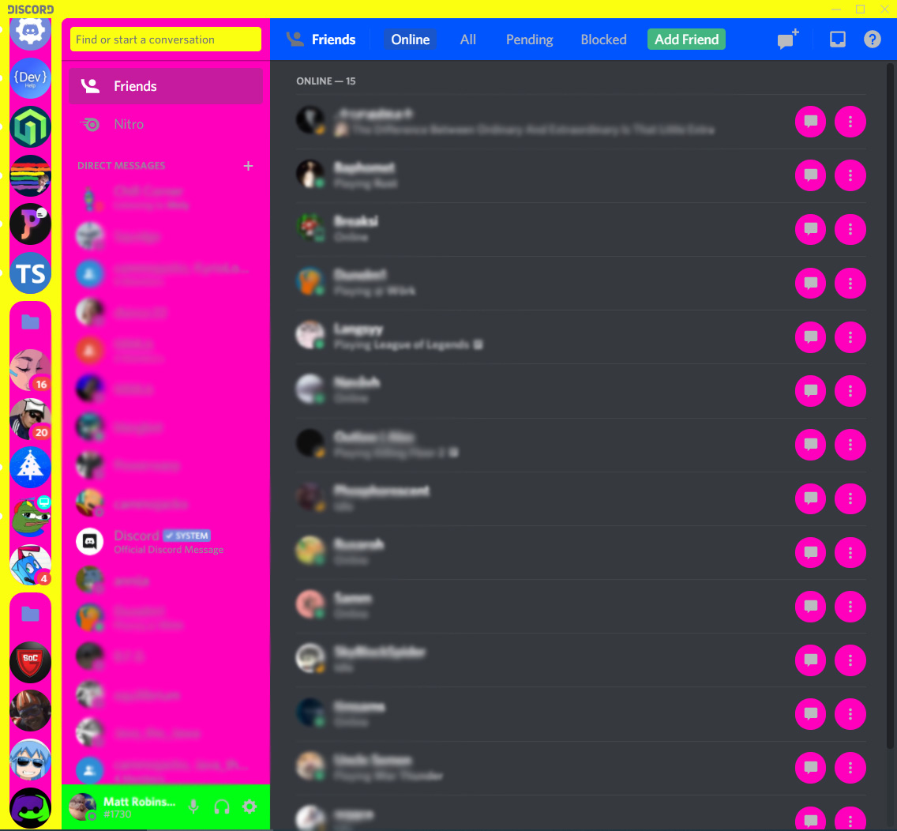
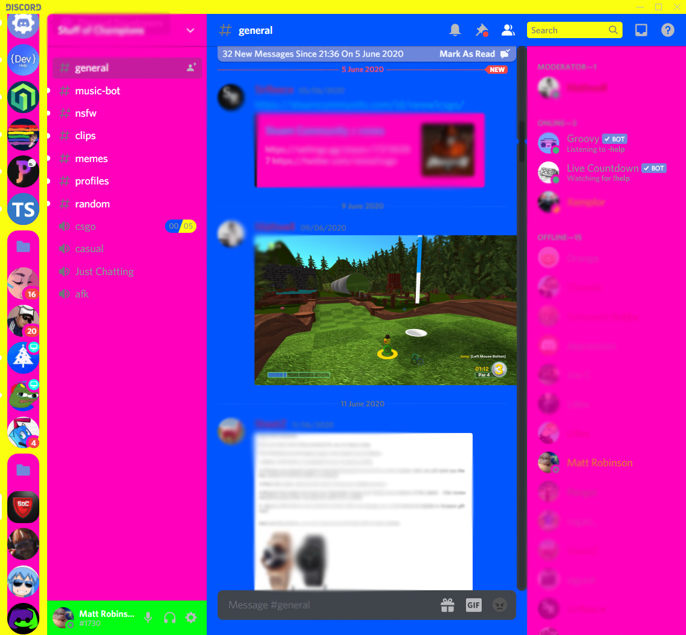

# Discord-patch
Patch client for Discord. Used for my bots.

Friend View                |  Server View
:-------------------------:|:-------------------------:
  |  

## Legend
<pre>
--background-primary: #0055ff;
--background-secondary: #ff00bc;
--background-secondary-alt: #00ff14;
--background-tertiary: #fbff10;
--background-accent: #00ffe7;
</pre>

#### API Request
https://discordapp.com/api/v6/channels/channel_id/messages

#### Payload
{
    "content":"Text sent to the text channel","nonce":"XXXXXXXXXXXXXXXXXX","tts":false
}

#### API Response
{
    "id": "XXXXXXXXXXXXXXXXXX", 
    "type": 0, 
    "content": "Text sent to the text channel.", 
    "channel_id": "XXXXXXXXXXXXXXXXX", 
    "author": 
    {
        "id": "XXXXXXXXXXXXXXXXXX", 
        "username": "Username", 
        "avatar": "XXXXXXXXXXXXXXXXXXXXXXXXXXXXXXXX", 
        "discriminator": "XXXX", 
        "public_flags": 0
    }, 
    "attachments": [], 
    "embeds": [], 
    "mentions": [], 
    "mention_roles": [], 
    "pinned": false, 
    "mention_everyone": false, 
    "tts": false, 
    "timestamp": "2020-07-24T10:32:09.501000+00:00", 
    "edited_timestamp": null, 
    "flags": 0, 
    "nonce": "XXXXXXXXXXXXXXXXXXXX"
}